===================================================
MontyPay Payment Gateway for Odoo E-commerce
===================================================

MontyPay Payment Gateway for Odoo E-commerce is an open source module that integrates
Odoo-based e-commerce websites with the MontyPay payment platform.
Developed by the MontyPay Technical Team — https://www.montypay.com/

Installation & Upgrade
======================

Download the latest module archive from https://github.com/montypay/odoo-extension/releases.

Unzip the downloaded archive and copy the ``payment_montypay`` folder to your Odoo addons directory:

* ``[ODOO_ROOT_FOLDER]/server/odoo/addons/``
* ``/var/lib/odoo/addons/[VERSION]/`` (Linux only)
* The ``addons_path`` defined in ``odoo.conf``

Then choose one of these approaches:

* In your Odoo administrator interface, browse to the **Configuration** tab and activate **Developer Mode**.
* Or restart the Odoo server with ``sudo systemctl restart odoo`` on Linux (or restart the Windows Odoo service).
  Odoo will update the application list on startup.
* Then browse to the **Applications** tab and click **Update Applications List**.

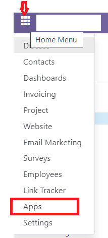

In your Odoo administrator interface, browse to the **Applications** tab, remove the "Applications"
filter from the search field and search for ``montypay``. Click **Install** (or **Upgrade**) on the
**MontyPay Payment Gateway Provider** module.

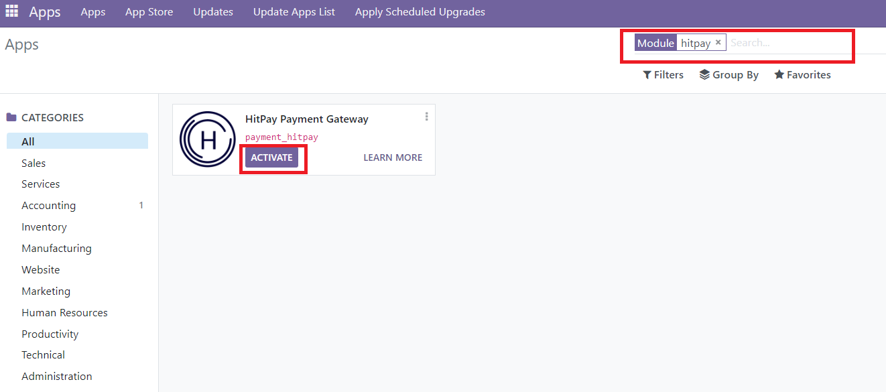

Configuration
=============

* Go to the **Website** menu.

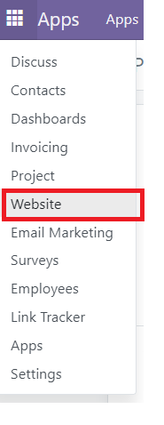

* Under **Configuration**, expand the **eCommerce** menu and click **Payment Providers**.

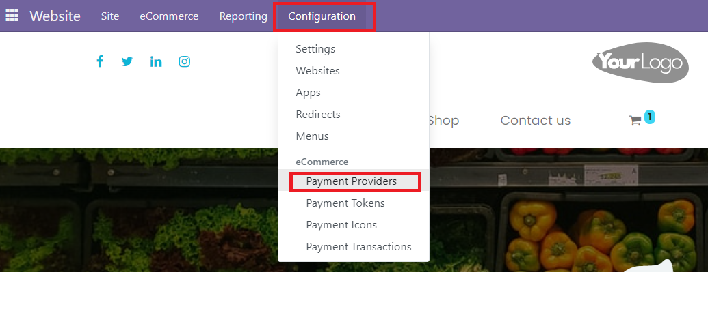

* Select the **MontyPay Payment Gateway** provider.

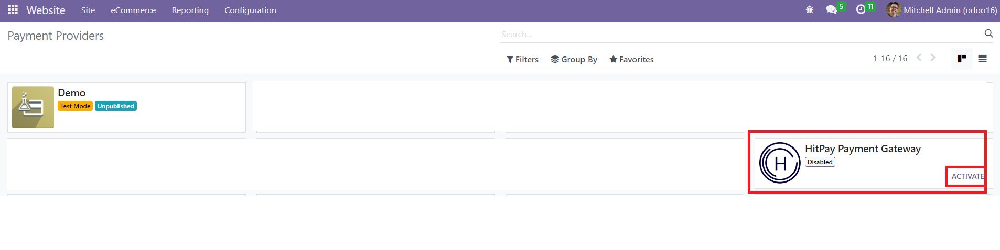

* Enter your MontyPay credentials (Merchant Key and Merchant Password).

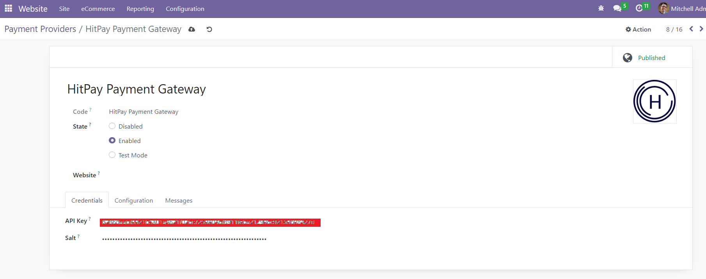

* In the **Configuration** tab, click **Enable Payment Methods** and activate MontyPay.
* Optionally set a custom title and restrict supported countries and currencies.

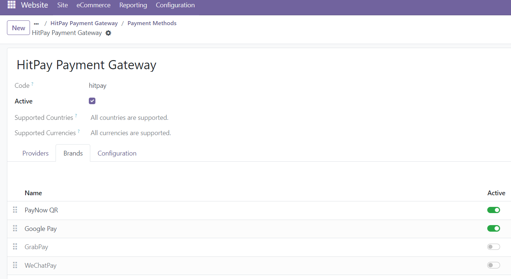

IMPORTANT
---------
* You must select a **Payment Journal** in the **Configuration** tab of the MontyPay Payment Gateway
  before the payment method becomes active.

Checkout
========

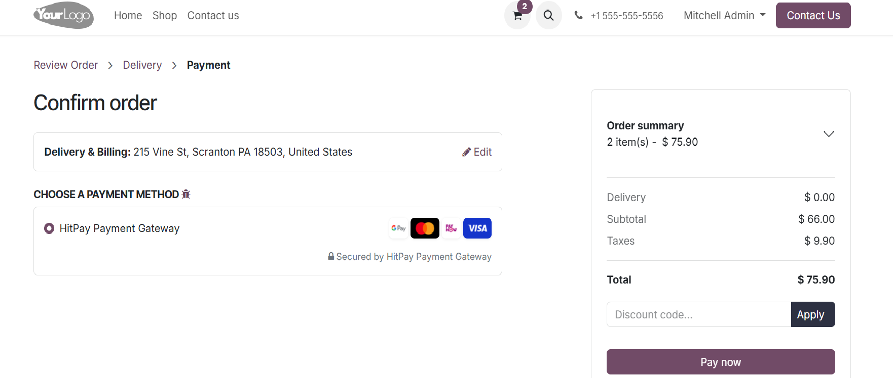

Payment Confirmation
--------------------

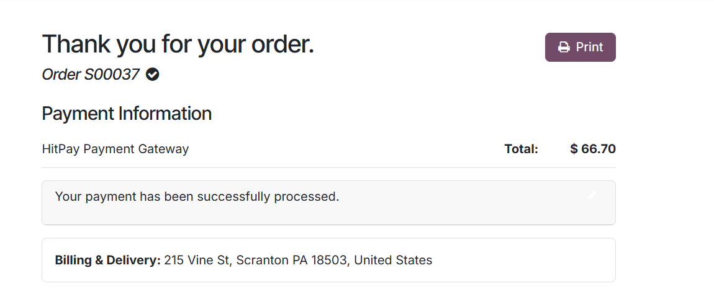

Sales Order
===========
Navigate to **eCommerce Orders** → **Orders**.

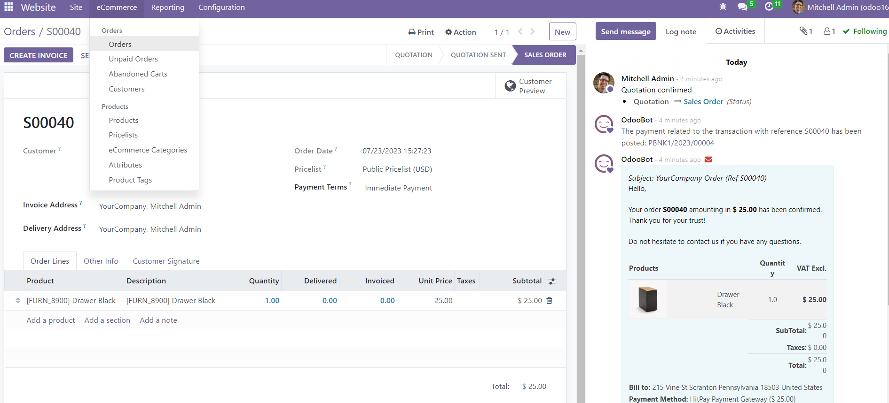

Payment Transaction Details
===========================
Navigate to **Configuration** → **eCommerce** → **Payment Transactions**.

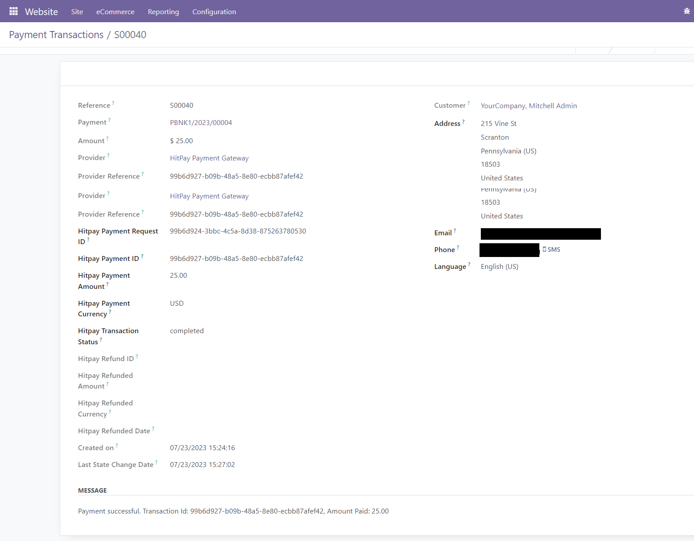

Refunds
=======
* In the payment transaction, click the payment link (e.g. ``PBNK1/2023/00004``).
* Click the **Refund** button and enter the amount to refund.

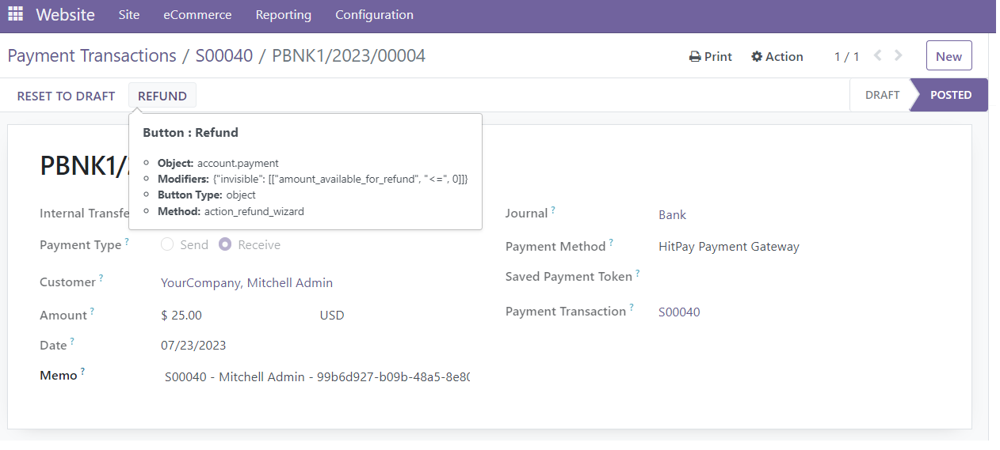
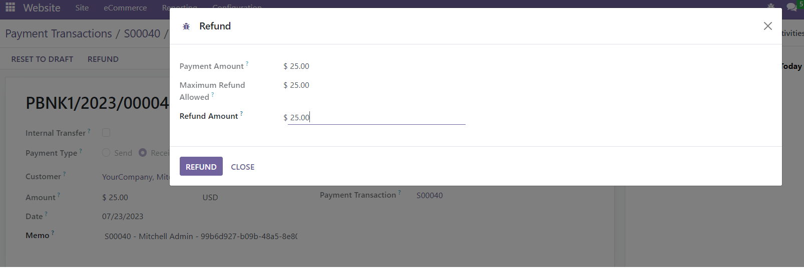

Change Log
==========

19.0.1.0.0
----------
* March 2026
* Initial release
